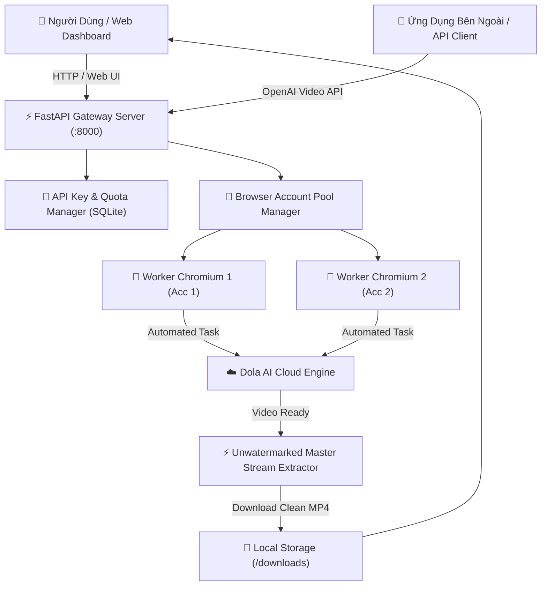

# 🎬 Dola Studio — AI Video Generation & Render Gateway

[](https://www.python.org/)
[](https://fastapi.tiangolo.com/)
[](https://github.com/kaliiiiiiiiii/patchright-python)
[](https://opensource.org/licenses/MIT)
[](https://github.com/bonnhatnguyen/dola-render-gateway/pulls)

**Dola Studio** (Dola Render Gateway) là giải pháp toàn diện cho việc tự động hóa sinh video AI từ Dola, cung cấp giao diện quản trị hiện đại, API chuẩn OpenAI, tự động điều phối phiên duyệt headless và trích xuất video gốc 100% không chứa watermark.

---

## 🌟 Tính Năng Nổi Bật (Key Features)

- **⚡ Hỗ trợ đa mô hình AI**: Tự động chuyển đổi giữa **Seedance 2.5** (chuyển động mượt mà, hiểu ngữ cảnh thông minh) và **Seedance 2.0** (tốc độ cao).
- **✨ Trích xuất video 100% Không Watermark**: Tự động phân giải luồng video CDN chất lượng cao (`&lr=unwatermarked`) trực tiếp từ Dola API, tải về máy mà không có logo hay watermark mờ.
- **🛡️ Browser Session Pool tự động**: Quản lý nhiều tài khoản đồng thời với Playwright/Patchright chống phát hiện bot, tự động xếp hàng tác vụ (Task Queue), giãn cách thời gian (rate limit/cooldown) và theo dõi quota tín dụng.
- **📥 Kéo thả Cookie JSON**: Hỗ trợ nhập cookie trực quan từ các tiện ích phổ biến (*Cookie-Editor*, *EditThisCookie*, *AccessHub Helper*).
- **🔑 Quản lý API Key đa khách hàng**: Tạo và cấp phát API Key cho bên thứ ba với hạn mức tác vụ theo ngày, số tác vụ đồng thời và thời lượng video cho phép (10s, 15s, 30s).
- **🎨 Giao diện Modern-Minimalist (Hallmark & Emil Kowalski Principles)**:
  - Thiết kế Light Theme thanh lịch, tinh gọn, không AI slop, không dark theme.
  - Thanh tab trượt mượt mà với chuyển động lò xo (spring physics).
  - Nút bấm tactile phản hồi cơ học chân thực.
  - Hệ thống thông báo Micro-Toast nổi không gián đoạn thao tác.

---

## 🏗️ Kiến Trúc Hệ Thống (Architecture)



---

## 🚀 Hướng Dẫn Cài Đặt & Khởi Chạy (Quick Start)

### 1. Yêu Cầu Tiên Quyết
* **Python 3.10+** (Khuyên dùng Python 3.12).
* Trình duyệt **Google Chrome** hoặc **Chromium**.
* Hệ điều hành: Windows, macOS, hoặc Linux.

### 2. Cài Đặt Môi Trường

```bash
# Clone repository
git clone https://github.com/bonnhatnguyen/dola-render-gateway.git
cd dola-render-gateway

# Tạo và kích hoạt môi trường ảo
python -m venv .venv

# Trên Windows:
.venv\Scripts\activate

# Trên Linux / macOS:
source .venv/bin/activate

# Cài đặt các thư viện phụ thuộc
pip install -r requirements.txt

# Cài đặt trình duyệt headless
patchright install chromium
```

### 3. Khởi Động Server

- **Trên Windows**: Nhấp đúp vào `start_server.bat` hoặc chạy:
  ```bash
  python server.py
  ```

- **Trên Linux / Docker / Server**:
  ```bash
  uvicorn server:app --host 0.0.0.0 --port 8000
  ```

Sau khi khởi động thành công:
* **Admin Dashboard**: `http://127.0.0.1:8000` (hoặc `http://127.0.0.1:8000/web`)
* **Tài liệu API Swagger**: `http://127.0.0.1:8000/docs`

---

## 👤 Hướng Dẫn Thêm Tài Khoản Dola

Hệ thống cần ít nhất 1 tài khoản Dola để sinh video. Bạn có 3 cách cực kỳ đơn giản:

1. **Cách 1 (Kéo thả Cookie JSON — Khuyên dùng)**:
   - Cài tiện ích [Cookie-Editor](https://cookie-editor.com/) trên trình duyệt, đăng nhập vào `dola.com`.
   - Bấm **Export -> Export as JSON**.
   - Mở Dashboard Dola Studio -> Chuyển sang tab **"Tài Khoản"** -> Kéo thả file JSON vào khung là xong!
2. **Cách 2 (File cookies.txt)**:
   - Dán chuỗi cookie thô vào file `cookies.txt` tại thư mục gốc. Hệ thống sẽ tự động nạp khi khởi động.
3. **Cách 3 (Đăng nhập Google OAuth trực tiếp)**:
   - Bấm nút **"＋ Thêm tài khoản Google"** trên giao diện để trình duyệt tự động đăng nhập.

---

## 📡 Tài Liệu API (API Reference)

### 1. Khởi Tạo Tác Vụ Sinh Video
```http
POST /v1/videos/generations
Content-Type: application/json
Authorization: Bearer <YOUR_API_KEY>

{
  "model": "seedance-2.5",
  "prompt": "Một chú mèo con lông xù màu vàng chạy trên đồng cỏ hoa hướng dương lúc hoàng hôn, 4k cinematic",
  "ratio": "16:9",
  "duration": 10,
  "reference_images": []
}
```

**Phản hồi (Response):**
```json
{
  "id": "video_36adaf96ef",
  "status": "queued",
  "created_at": 1726543200
}
```

### 2. Truy Vấn Tiến Độ & Nhận Link Video
```http
GET /v1/videos/video_36adaf96ef
```

**Phản hồi khi hoàn thành:**
```json
{
  "id": "video_36adaf96ef",
  "status": "completed",
  "video_url": "http://127.0.0.1:8000/downloads/clean_38417930345701393.mp4",
  "duration": 10
}
```

### 3. Trích Xuất Video Gốc Không Watermark Từ Link Chat
```http
POST /api/extract_unwatermarked
Content-Type: application/json

{
  "url_or_id": "38417930345701393"
}
```

---

## ☕ Ủng Hộ Tác Giả (Support & Sponsorship)

Dự án này được phát triển và chia sẻ **hoàn toàn miễn phí vì cộng đồng**. Nếu công cụ này giúp ích cho công việc hoặc các dự án sáng tạo của bạn, bạn có thể gửi một ly cà phê để tiếp thêm động lực cho việc duy trì và phát triển các tính năng mới:

<div align="center">
  
  <br/>
  <p>
    <b>Ngân hàng</b>: Vietcombank (VCB)<br/>
    <b>Số tài khoản</b>: <code>0921000724236</code><br/>
    <b>Chủ tài khoản</b>: <b>NGUYEN THI THU TRUYEN</b><br/>
    <b>Nội dung chuyển</b>: <code>Ung ho Dola Studio</code>
  </p>
</div>

---

## 📄 Bản Quyền (License)

Dự án được phân phối dưới giấy phép [MIT License](LICENSE). Mọi người đều có quyền tự do sử dụng, chỉnh sửa và tích hợp vào các dự án cá nhân hoặc thương mại.
